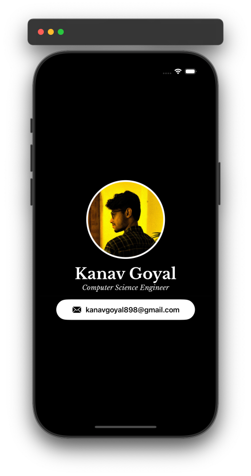

# MeCard App Overview

**MeCard** is a SwiftUI-based iOS application designed to display user profile information, resembling a digital business card. It employs modern SwiftUI components, a clean design, and allows for easy customization.

## Preview

  

## Conclusion

The **MeCard** app serves as a simple yet effective demonstration of using SwiftUI to build a modular and responsive user interface. With its clean structure, it allows developers to easily customize and extend functionality, making it a solid foundation for personal projects.

## Future Enhancements

- **Dynamic Content Loading:** Incorporate features to load user data from a server or database.
- **Social Media Links:** Expand the `InfoSection` to include icons for social media platforms.
- **Theming:** Add support for light/dark mode to enhance user experience.
- **Accessibility Features:** Implement larger touch targets and voiceover support to improve usability.
